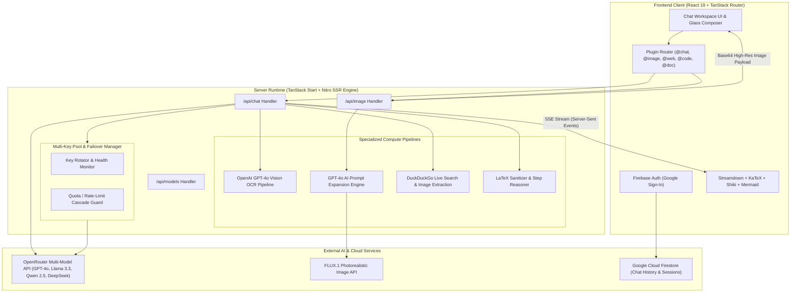
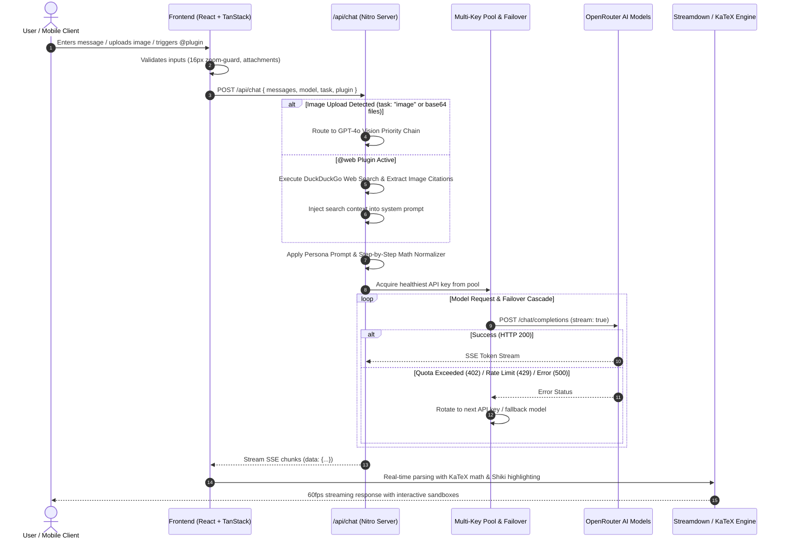
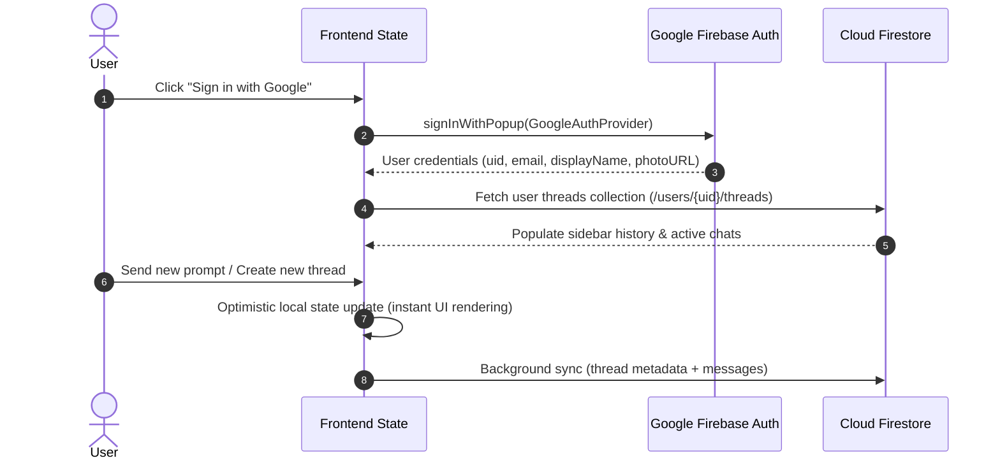

# rYuk.ai — Enterprise Multi-Model AI Workspace & Intelligence Platform

[](https://ryuk-ai.vercel.app)
[](https://tanstack.com/start)
[](https://tailwindcss.com)
[](https://www.typescriptlang.org/)
[](https://firebase.google.com/)

**rYuk.ai** is an enterprise-grade AI intelligence workspace engineered with dynamic multi-model compute routing, OpenAI GPT-4o vision comprehension, photorealistic FLUX-Realism image generation, live web search synthesis, interactive code execution sandboxes, and human-friendly step-by-step mathematical reasoning.

---

## 🏛️ System Architecture



---

## 🔄 End-to-End Execution Workflows

### 1. Multi-Modal Chat & Streaming Workflow (`/api/chat`)



---

### 2. Next-Gen Image Generation Workflow (`/api/image`)

```mermaid
sequenceDiagram
    autonumber
    actor User as User
    participant Client as Composer UI
    participant ImageAPI as /api/image Handler
    participant AIExpander as GPT-4o Prompt Intelligence
    participant FLUX as FLUX.1 Realism Engine

    User->>Client: Types image prompt (e.g., "Dog Barking on Man 4k")
    Client->>ImageAPI: POST /api/image { prompt: "Dog Barking on Man 4k" }
    
    rect rgb(30, 30, 27)
        Note over ImageAPI,AIExpander: Stage 1: AI Prompt Intelligence
        ImageAPI->>AIExpander: Expand short prompt into vivid multi-subject scene
        AIExpander-->>ImageAPI: Return detailed description with subjects, lighting & textures
    end

    rect rgb(20, 20, 18)
        Note over ImageAPI,FLUX: Stage 2: High-Resolution Rendering
        ImageAPI->>FLUX: Render image (1024x1024, flux-realism model)
        FLUX-->>ImageAPI: Return 1024x1024 Base64 Image Payload
    end

    ImageAPI-->>Client: Return { imageUrl, prompt, enhancedPrompt }
    Client-->>User: Display image with Lightbox, Zoom, and Download options
```



---

### 3. Cloud Session Persistence & Auth Workflow



---

## 🌟 Comprehensive Feature Breakdown

### 🧠 1. Dynamic Multi-Model Routing & Automatic Failover
- **Intelligent Task Classification**: Inspects inbound prompts (code, math, vision, creative, reasoning) and routes to optimal model architectures.
- **Multi-Key Pool Failover**: Rotates across comma-separated keys (`OPENROUTER_API_KEY`, `OPENROUTER_API_KEYS`). If one key encounters a credit quota or rate limit (`402`, `429`), the request automatically cascades to the next key with zero downtime.
- **Top Tier Models**: `openai/gpt-4o`, `openai/gpt-4o-mini`, `meta-llama/llama-3.3-70b-instruct`, `qwen/qwen-2.5-72b-instruct`, `deepseek/deepseek-chat`, and free-tier fallback models (`google/gemma-4-31b-it:free`, `nvidia/nemotron-3.5-lightning:free`, `liquid/lfm-2.5-2.6b:free`).

### 🖼️ 2. OpenAI GPT-4o Vision & Multimodal OCR
- **High-Accuracy Image Reading**: Uploaded images are routed directly to OpenAI's GPT-4o vision engine.
- **Document & Diagram Analysis**: Reads handwritten equations, architectural flowcharts, screenshots, and visual documents.
- **Multi-File Uploads**: Drag-and-drop or paste screenshots directly into the composer.

### 🎨 3. Next-Gen Image Studio (FLUX-Realism Engine)
- **1024x1024 Photorealistic Output**: Generates ultra-crisp images using FLUX.1 architecture (`flux-realism`, `flux-anime`, `flux-3d`, `turbo`).
- **AI Prompt Expansion**: Short user keywords (e.g. *"Dog Barking on Man 4k"*) are expanded using GPT-4o into detailed, multi-subject cinematic scene descriptions to ensure no subjects or textures are missed.

### 🌐 4. Real-Time Web Search & Source Synthesis (`@web`)
- **Live Internet Browsing**: Accesses real-time factual knowledge, news, and live reference links via DuckDuckGo.
- **Automatic Reference Image Embedding**: Extracts relevant high-quality image citations alongside synthesized answers.

### 📐 5. Human-Readable Math & KaTeX Typesetting
- **No Cluttered Markup**: Raw LaTeX macros (`\boxed{}`, `\frac{}{}`) and surrounding dollar signs (`$`) are pre-processed and converted into clean, human-friendly arithmetic steps.
- **KaTeX Equations**: Complex scientific formulas render via CDN-backed KaTeX typography.
- **Highlighted Final Answers**: Outputs clear solutions (e.g. `**Final Answer: x = 1**`).

### 💻 6. Live Interactive Code Sandboxes & Mermaid Diagrams
- **Interactive Code Sandboxes**: HTML, CSS, and JavaScript code blocks include an interactive live execution sandbox with a full-screen preview.
- **Mermaid Flowcharts**: Native compilation of sequence diagrams, entity relationship diagrams, and mind maps.
- **Syntax Highlighting**: Powered by Shiki for code blocks with one-click copy.

### 📱 7. Mobile-First UI & Zero Auto-Zoom Composer
- **Auto-Zoom Prevention**: Strict `maximum-scale=1.0` viewport configuration and `16px` (`text-base`) mobile input styling prevent iOS Safari and mobile Chrome from unwanted auto-zooming.
- **Responsive Layout**: Collapsible desktop sidebar strip with a clean mobile slide-out navigation drawer.
- **Visual Modes**: Smooth switching between OLED Deep Dark Mode and Glass Transparency Mode.

### 🔐 8. Cloud Chat Sync & Firebase Authentication
- **One-Click Google Sign-In**: Firebase Authentication integration.
- **Cross-Device Chat Storage**: Firestore synchronization saves conversation threads, titles, and attachments across devices.

---

## 📁 Repository Structure

```
SidAnk/
├── .env                              # Environment secrets (API keys)
├── package.json                      # Project dependencies & scripts
├── tsconfig.json                     # TypeScript compiler options
├── vite.config.ts                    # Vite + TanStack Start configuration
├── public/                           # Static public assets (favicon, images)
└── src/
    ├── config/
    │   └── ai-behaviors.ts           # Persona prompts (ChatGPT, Claude, rYuk)
    ├── components/
    │   ├── ai-elements/              # Modular AI UI components
    │   │   ├── message.tsx           # Streamdown, KaTeX preprocessor, Code runner
    │   │   ├── conversation.tsx      # Chat list virtualized scroll view
    │   │   ├── prompt-input.tsx      # Multi-modal composer & file uploader
    │   │   └── shimmer.tsx           # Thinking & loading shimmer animations
    │   ├── chat/
    │   │   ├── ChatSidebar.tsx       # Sidebar thread history drawer
    │   │   ├── CollapsedSidebarStrip.tsx # Compact desktop left-rail navigation
    │   │   ├── ModelPicker.tsx       # AI Model selector modal & tier pills
    │   │   └── plugins.ts            # Plugin registry (@chat, @image, @web, etc.)
    │   └── ui/                       # Base UI primitives (buttons, dropdowns, dialogs)
    ├── lib/
    │   ├── firebase.ts               # Firebase Auth & Firestore sync
    │   ├── openrouter-models.ts      # OpenRouter model discovery & caching
    │   └── utils.ts                  # Tailwind class mergers and helpers
    └── routes/
        ├── __root.tsx                # Root layout, HTML head, KaTeX styles
        ├── index.tsx                 # Main AI workspace page & state controller
        └── api/
            ├── chat.ts               # Streaming chat SSE router with key failover
            ├── image.ts              # FLUX + OpenRouter image generation engine
            └── models.ts             # Dynamic OpenRouter models registry API
```

---

## 🔌 API Endpoints Reference

| Endpoint | Method | Payload / Params | Description |
| :--- | :--- | :--- | :--- |
| `/api/chat` | `POST` | `{ messages, model, task, plugin, webSearch }` | Streams AI completions via SSE. Handles task parameter detection, multi-key pool failover, and live web search injection. |
| `/api/image` | `POST` | `{ prompt, style, size }` | Generates 1024x1024 photorealistic images. Includes AI prompt expansion and FLUX-Realism / Turbo fallbacks. |
| `/api/models` | `GET` | *None* | Fetches and caches the list of available OpenRouter models with pricing and architectural modalities. |

---

## ⚙️ Environment Variables Setup

Create a `.env` file in the root of the project:

```env
# Multi-Key Pool (Comma-separated for automated failover)
OPENROUTER_API_KEY=sk-or-v1-primary-key,sk-or-v1-backup-key
OPENROUTER_API_KEYS=sk-or-v1-primary-key,sk-or-v1-backup-key

# Optional Custom Deployment URLs
VITE_SITE_URL=https://ryuk-ai.vercel.app
```

---

## 🚀 Local Development

### Prerequisites
- **Node.js**: `v20.x` or `v22.x` / `v24.x`
- **npm** or **pnpm**

```bash
# 1. Install dependencies
npm install

# 2. Launch development server with HMR
npm run dev

# 3. Access local workspace
# http://localhost:8080
```

---

## 🚢 Production Deployment

Deploy in seconds with **Vercel CLI**:

```bash
# Production Deployment
cmd.exe /c npx -y vercel --prod --yes
```

Ensure environment variables (`OPENROUTER_API_KEY`, `OPENROUTER_API_KEYS`) are configured in **Vercel Dashboard > Project Settings > Environment Variables**.

---

## 🛡️ Security & Performance

- **Server-Side API Key Protection**: All OpenRouter credentials remain securely on the Nitro server runtime; keys are never exposed to client browsers.
- **SSR Hydration Guarding**: `typeof window !== "undefined"` guards protect browser storage access against SSR crashes.
- **Smart SSE Chunking**: RequestAnimationFrame flushing provides 60fps streaming text performance with zero UI freezing.

---

## 📜 License
MIT License © [rYuk.ai](https://ryuk-ai.vercel.app)
